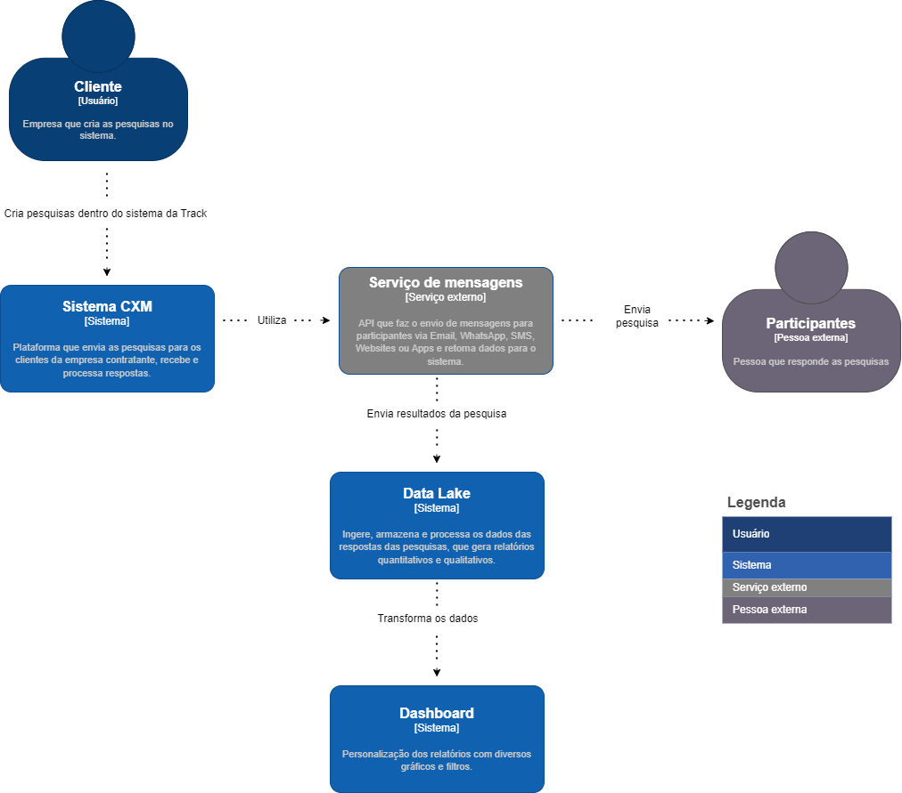
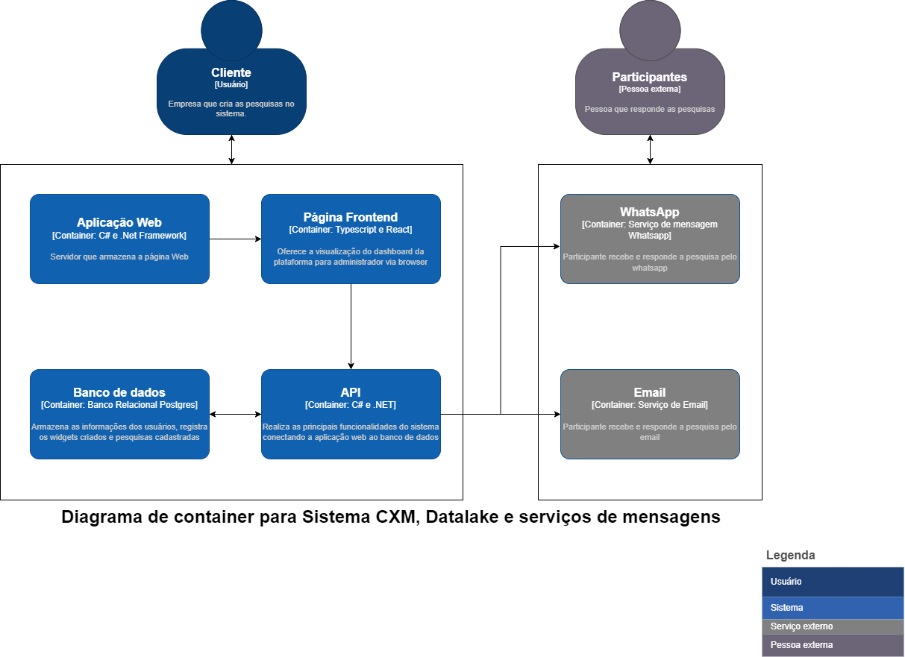

# Documentação de arquitetura 

### Plano e definição dos testes

| Tipo         | Nome                               | Descrição                                                                 | Dados de Entrada                                           | Passos                                                                                                                                                                                                                                         | Dados de Saída                         | Resultado esperado                                               | Justificativa                                                                                                                                                                    | Tecnologias Que Podem Ser Utilizadas                   |
|--------------|------------------------------------|---------------------------------------------------------------------------|-------------------------------------------------------------|------------------------------------------------------------------------------------------------------------------------------------------------------------------------------------------------------------------------------------------------|---------------------------------------|------------------------------------------------------------------|-------------------------------------------------------------------------------------------------------------------------------------------------------------------------------------|----------------------------------------|
| Caixa Preta  | Acesso ao menu de widgets          | Validar se o menu de widgets é acessível a partir da interface principal. | Usuário autenticado no sistema.                              | 1. Realizar login se necessário.<br>2. Navegar até o menu lateral.<br>3. Localizar e clicar na opção “Widgets”.                                                                                                                                | Lista de widgets disponíveis.          | O submenu de Widgets deve ser exibido sem erros.                  | Verifica a acessibilidade e visibilidade do menu de widgets, componente essencial para a gestão de widgets.                                                                         | Selenium para testes de UI             |
| Unitário     | Criação de widget                  | Verificar o processo de criação de um novo widget e se todos os campos necessários estão funcionando conforme esperado. | Dados do widget: nome, descrição, configurações.            | 1. Acessar o menu de widgets.<br>2. Clicar em “Novo widget”.<br>3. Inserir as configurações necessárias e nomear o widget.<br>4. Salvar o novo widget.                                                                                       | Confirmação de criação do widget.      | O widget é criado com as configurações fornecidas e um aviso de sucesso é apresentado. | Assegura que a funcionalidade de criação de widgets funciona isoladamente sem erros.                                        | xUnit ou NUnit para testes unitários em C#    |
| Integração   | Abrir widget                       | Confirmar que o widget pode ser aberto e visualizado após a criação.      | ID do widget criado.                                       | 1. Localizar o widget criado na lista de widgets disponíveis.<br>2. Clicar para abrir o widget.                                                                                                                                                | Interface do widget aberto.            | O widget abre corretamente e mostra todas as informações e configurações aplicadas. | Testa a integração da funcionalidade de visualização de um widget após sua criação.                                         | Cypress para testes de integração |
| Caixa Preta  | Responder pesquisa no widget       | Confirmar que as respostas das perguntas são gravadas e visíveis na tela de interação. | Resposta à pesquisa no widget.                             | 1. Responder à pesquisa.<br>2. Verificar na tela de interações se a resposta foi registrada.                                                                                                                                                    | Resposta registrada na tela de interações. | Respostas finalizadas devem aparecer na tela de interação, e as não finalizadas, não. | Valida a funcionalidade de submissão e registro de respostas no widget, uma ação crítica do usuário.                          | Selenium para testes de UI             |
| Caixa Preta  | Verificar registro de interação    | Testar se uma interação individual é registrada corretamente após a resposta à pesquisa no widget. | Detalhes da interação: widget ID, resposta dada.           | 1. Responder a pesquisa no widget.<br>2. Acessar a tela de interações.<br>3. Procurar pela interação recente.                                                                                                                                  | Detalhes da interação na tela.         | A interação deve ser listada com os detalhes corretos na tela de interações. | Confirma que o registro de uma única resposta é processado e exibido corretamente.                                          | Selenium para testes de UI             |
| Caixa Preta  | Verificar registros de interações | Garantir que múltiplas interações sejam registradas e exibidas corretamente. | Múltiplas respostas submetidas nas pesquisas do widget.    | 1. Submeter várias respostas na pesquisa através do widget.<br>2. Acessar a tela de interações.<br>3. Verificar todos os registros de interações.                                                                                               | Lista de todas as interações.          | Todas as interações devem estar listadas com detalhes corretos.  | Valida a correta agregação e visualização de múltiplas interações com o widget.                                             | Selenium para testes de UI             |
| Caixa Preta  | Validação de Dados no Widget       | Testar a validação de dados inseridos no widget.                          | Dados de entrada inválidos para a pesquisa.                 | 1. Inserir dados inválidos na pesquisa do widget.<br>2. Tentar submeter a pesquisa.                                                                                                    | Mensagem de erro.                      | Mensagens de erro devem ser exibidas para entradas inválidas.    | Verifica se o sistema impede submissões de dados inválidos, mantendo a integridade da entrada de dados.                       | Selenium para testes de UI             |
| Unitário    | Desempenho do Widget               | Testar a velocidade de carregamento e resposta do widget.                 | -                                                           | 1. Carregar o widget.<br>2. Medir o tempo de resposta ao submeter uma interação.                                                                                                        | Tempo de resposta do widget.           | O widget deve carregar e responder dentro de um limite de tempo aceitável. | Assegura que o widget atende aos requisitos de desempenho, proporcionando uma boa experiência ao usuário.                     | Ferramentas de perfilamento de desempenho    |
| Integração  | Compatibilidade do Widget          | Verificar a compatibilidade do widget com diferentes navegadores.         | -                                                           | 1. Abrir o widget em diferentes navegadores.<br>2. Testar a funcionalidade completa em cada navegador.                                                                                  | Funcionamento adequado em todos os navegadores. | O widget deve funcionar corretamente em todos os navegadores populares. | Garante que usuários em diferentes plataformas tenham experiências consistentes.                                             | BrowserStack ou similar para compatibilidade  |

### Descrição tipos de teste
- Testes de Caixa Preta: Avaliação do comportamento do sistema sem conhecimento da sua estrutura interna.
- Testes de Integração: Verificação da integração entre diferentes módulos ou serviços do sistema.
- Testes Unitários: Testes isolados para verificar a corretude de unidades individuais de código.
- Testes de Carga: Avaliação do desempenho do sistema sob condições de carga elevada.

Para a realização dos testes de integração, utilizamos a ferramenta Cypress. Já os testes de carga foram realizados com o uso de TypeScript e k6. E os unitários foram realizados em c# para o backend e frontend em ts. Este conjunto de ferramentas e metodologias nos permitiu abordar de forma abrangente a qualidade do software em diferentes níveis e aspectos.

### Descrição tipos de teste
- Testes de Caixa Preta: Avaliação do comportamento do sistema sem conhecimento da sua estrutura interna.
- Testes de Integração: Verificação da integração entre diferentes módulos ou serviços do sistema.
- Testes Unitários: Testes isolados para verificar a corretude de unidades individuais de código.
- Testes de Carga: Avaliação do desempenho do sistema sob condições de carga elevada.

Para a realização dos testes de integração, utilizamos a ferramenta Cypress. Já os testes de carga foram realizados com o uso de TypeScript e k6. E os unitários foram realizados em c# para o backend e frontend em ts. Este conjunto de ferramentas e metodologias nos permitiu abordar de forma abrangente a qualidade do software em diferentes níveis e aspectos.

## Arquitetura C4 Model - Contexto

</img>

### Atores
Cliente: Refere-se à empresa que cria e envia pesquisas para seus clientes através do sistema. Este é o usuário do Sistema CXM.

Participantes: São os indivíduos que recebem e respondem às pesquisas. Eles são considerados externos ao sistema de pesquisa.

### Componentes
Sistema CXM: É a plataforma central que gerencia a criação e envio de pesquisas para os clientes da empresa contratante. Também recebe e processa as respostas das pesquisas.

Serviço de mensagens: Este é um sistema de terceiros que é utilizado para enviar as pesquisas para os participantes. Ele pode interagir com vários canais de comunicação, como e-mail, WhatsApp, SMS, websites ou apps para entregar as pesquisas e coletar dados.

Data Lake: É um sistema de armazenamento que ingere, armazena e processa os dados das respostas das pesquisas, gerando relatórios quantitativos e qualitativos.

Dashboard: É a interface de apresentação, onde os dados processados são exibidos de maneira significativa. Desempenham um papel essencial ao fornecer uma visualização interativa dos dados, permitindo ao Cliente filtrar e dissecar as informações para descobrir insights valiosos. Eles transformam grandes volumes de dados brutos em informações acionáveis.

- Esse ecossistema permite um ciclo contínuo de feedback. As respostas coletadas e analisadas resultam em dados que podem informar o Cliente sobre ações a serem tomadas, talvez levando a criação de novas pesquisas e começando o ciclo novamente.

- O diagrama como um todo demonstra um sistema de gestão de experiência do cliente (CXM) que integra várias ferramentas e plataformas para coletar e analisar feedback do cliente de maneira eficiente e escalável. A capacidade de se integrar com serviços externos e de processar grandes volumes de dados torna o sistema valioso para empresas que buscam melhorar continuamente sua compreensão e relacionamento com os clientes.

## Arquitetura C4 Model - Container

</img>

### Atores
- Cliente: Representa a empresa que cria as pesquisas dentro do sistema. <br>
- Participantes: Referem-se aos indivíduos que respondem às pesquisas, comunicando-se através de WhatsApp ou e-mail.

### Componentes
- Aplicação Web: Atua como o servidor que hospeda a página web, onde as pesquisas são criadas e gerenciadas.

- Página Frontend: Fornece a interface do usuário para visualização e interação com o dashboard da plataforma. É o que o administrador vê e usa no navegador.
  
- API: É o meio pelo qual a aplicação web se comunica com o banco de dados. Realiza as principais funcionalidades do sistema conectando a aplicação web ao banco de dados.

- Banco de dados: Responsável pelo armazenamento das informações dos usuários, registros dos widgets criados e pesquisas cadastradas.

- WhatsApp: Serviço de mensagens usado pelos participantes para receber e responder às pesquisas pelo WhatsApp.

- Email: Outro canal de comunicação para os participantes receberem e responderem às pesquisas.

### Relacionamentos e Fluxo

O Cliente cria pesquisas que são armazenadas e gerenciadas pela Aplicação Web. A Aplicação Web interage com a Página Frontend para exibir o dashboard, permitindo ao administrador gerenciar as pesquisas e visualizar respostas e métricas. <br>
A API, usando C# e .NET, funciona como uma ponte entre a Aplicação Web e o Banco de dados, permitindo o armazenamento e recuperação de dados de pesquisas e respostas. A Página Frontend também se comunica com a API para exibir dados atualizados e interagir com o Banco de dados. <br>
Os Participantes recebem as pesquisas e interagem com o sistema através de WhatsApp ou Email, dependendo do canal de comunicação escolhido. <br>
As respostas coletadas via WhatsApp ou Email dos Participantes são enviadas de volta ao sistema e processadas, atualizando o Banco de dados através da API. 

Este diagrama representa um sistema de gestão de pesquisas interativo, onde a comunicação entre a aplicação web, o banco de dados e os participantes é essencial para a coleta e análise de dados. A utilização de containers para cada componente sugere que a aplicação é modular e pode ser escalável, facilitando a manutenção e o desenvolvimento contínuo.

## Implementação frontend

Implementação de Frontend em React para otótipo
A implementação de um frontend em React para um protótipo tem como objetivo fornecer um guia visual e interativo para o desenvolvimento de um projeto voltado para testes. Este protótipo serve como uma ferramenta essencial para visualizar a interface do usuário, explorar a interação com os componentes e entender o fluxo geral da aplicação.

## Implementação e Práticas de Segurança

Ao integrar nosso widget em sua página web, é essencial estar atento às seguintes práticas de segurança para garantir uma experiência segura e confiável para você e seus usuários:

Origem do Widget <br>
O widget só funcionará corretamente nas páginas cujos URLs correspondam ao domínio especificado durante o processo de criação do widget. Esta medida de segurança visa prevenir o uso não autorizado do seu widget e assegurar que apenas as páginas que você define possam incorporá-lo e interagir com ele.

Sanitização de Dados <br>
Para evitar vulnerabilidades de segurança, como ataques de injeção de código, nosso widget implementa rigorosas práticas de sanitização de dados. É importante que, ao interagir com o widget, as entradas do usuário sejam tratadas de forma a prevenir a execução de scripts maliciosos.

## Testes

### Implementação de testes
Ao decorrer da sprint, foi iniciado a realização dos testes unitários dos endpoints da aplicação, inicialmente planejado a maioria dos testes falham e depois com os ajustes e refatoração dos códigos de backend e testes é esperado que todos os testes rodem e passem.

O plano de testes conta com diversos tipos de teste, como, unitário, caixa preta e integração. Como parte do planejamento e organização de desenvolvimento apenas os unitários foram ininiciados e os demais irão ser produzidos ao decorrer da próxima sprint, com os conhecimentos adquiridos e o avanço do desenvolvimento do frontend, backend e o início das integrações.

Os testes que foram iniciados estão dentro da pasta: src/tests/src 

Utilização de práticas como design patters começou a ser implementação como forma de padrão da equipe ao longo desse projeto e será dado seguimento em todos os demais testes que serão produzidos para o projeto, padrões como esse são importantes e ajudam na organização e clareza nos códigos dos testes.

Para rodar os testes é necessário o uso do comando dentro da pasta de testes que possui o caminho acima:
Npm run jest

Os testes foram produzidos em TypeScript

Foram feitos os testes de Delete, Post, Get e Put, cada um com um propósito específico dentro da aplicação. Os testes de Delete visam garantir que os registros sejam removidos de forma eficaz, sem deixar resíduos ou afetar dados relacionados de forma indevida. Os testes de Post focam na correta inserção de novos dados, assegurando que todos os campos necessários sejam validados e que o novo registro seja criado conforme esperado. Já os testes de Get são projetados para verificar se a recuperação de informações está ocorrendo de maneira correta, seja de um único registro ou de um conjunto de dados, garantindo que os filtros e parâmetros de busca funcionem como previsto. Por fim, os testes de Put têm como objetivo validar as operações de atualização, certificando-se de que os dados existentes possam ser modificados adequadamente, mantendo a integridade e a consistência dos registros após as alterações.

### Validação de Fluxo Principal e Alternativo:
Ao decorrer do projeto iremos incorporar testes para validar tanto o fluxo principal quanto os fluxos alternativos de cada endpoint, assegurando uma cobertura abrangente de casos de uso. Isso inclui situações como inserções bem-sucedidas de dados (fluxo principal) e tratamento de entradas inválidas ou requisições malformadas (fluxos alternativos), aprimorando significativamente a robustez da nossa aplicação.

### Qualidade Geral e Coerência da Suíte de Testes
Nos esforçamos para manter uma alta qualidade e coesão em nossa suíte de testes, refletindo um compromisso contínuo com práticas de desenvolvimento orientadas a testes. A consistência e a confiabilidade dos testes são essenciais para a nossa confiança no software que estamos desenvolvendo, reforçando a importância de uma suíte de testes bem planejada e executada.

Ao seguir essas diretrizes e práticas, a equipe está não apenas melhorando a qualidade do código através de testes unitários eficazes, mas também estabelecendo um padrão de qualidade que passa por todo o ciclo de desenvolvimento do projeto.

## Testes de frontend

Os testes foram realizados com o uso do Cypress

Este documento fornece instruções sobre como executar a suíte de testes Cypress para a páginas de frontend.

## Pré-requisitos

Antes de começar, certifique-se de ter o Node.js instalado em sua máquina. Cypress é um framework de testes baseado em Node.js.

### a) Clone da solução

Para obter o projeto em sua máquina local, clonar esse repositório do GitHub

### b) Restauração de pacotes

npm install

### c) Execução dos da suíte

npx cypress open

## Testes Realizados e estrutura

Foram realizados testes para as principais partes do frontend, a seguir estão um trecho de código com um exemplo de um teste realizado para a página de formulário 

```
    it('should display the label of link', () => {
        cy.get('form > :nth-child(2)').should(
        'contain', 'Link do Widget', 'contain', 'placeholder', 'Ex: https://forms.gle/123456');
      });
````

e a seguir está os resultados dos testes apresentados no Cypress

</img>

</img>
