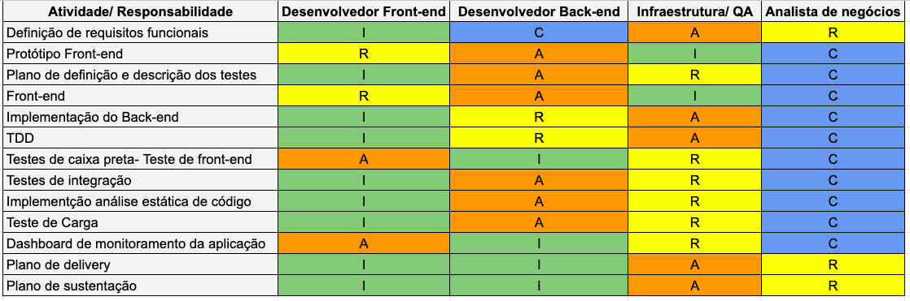

# Diagrama do processo de sustentação do software em caso de incidente em produção

</img>

# Matriz Raci

## Explicação:

### Uma Matriz RACI é uma ferramenta de gerenciamento de projetos usada para atribuir e exibir responsabilidades de tarefas ou decisões dentro de uma equipe ou organização. O termo RACI é um acrônimo derivado das quatro funções principais que as partes interessadas podem ter em qualquer tarefa: Responsável (R), Aprovador (A), Consultado (C) e Informado (I). "Responsável" é quem executa a tarefa, "Aprovador" é quem toma decisões e aprova o trabalho final, "Consultado" é quem oferece conhecimento e opinião, e "Informado" é quem precisa ser mantido a par do progresso, mas não está diretamente envolvido no trabalho.

</img>

## Explicação nossa matriz raci:

### Nossa matriz lista uma série de atividades típicas em desenvolvimento de software, como definição de requisitos funcionais, prototipagem de front-end e implementação de back-end, entre outras. Para cada atividade, a matriz especifica os papéis dos membros da equipe, que incluem Desenvolvedor Front-end, Desenvolvedor Back-end, Infraestrutura/QA (Garantia de Qualidade) e Analista de Negócios. As letras R, A, C e I são usadas para indicar quem é Responsável, quem é o Aprovador, quem deve ser Consultado e quem deve ser Informado em cada atividade. Por exemplo, o Desenvolvedor Front-end é marcado como Responsável (R) pela prototipagem do front-end, enquanto o Analista de Negócios é marcado como Consultado (C) nessa mesma tarefa. Isso oferece uma visão clara de quem é encarregado de quais atividades e como a comunicação e a tomada de decisão devem fluir entre os membros da equipe para uma gestão eficiente do projeto.

# Planilha SLA.

## Explicação:

### Um SLA, ou Acordo de Nível de Serviço, é uma parte contratual que define o nível de serviço esperado entre um provedor de serviço e um cliente. Uma planilha de SLA é uma ferramenta para documentar especificações detalhadas de desempenho, como disponibilidade de serviço, tempos de resposta e outras métricas chave de desempenho que o fornecedor se compromete a cumprir. Essas planilhas são utilizadas para estabelecer expectativas claras e fornecer uma base para o monitoramento do desempenho do serviço e para abordar problemas ou desvios dos padrões acordados.

</img>

## Explicação nossa planilha SLA:

### Nossa planilha SLA, descreve os componentes específicos de um sistema e os níveis de desempenho associados a cada um deles. Por exemplo, temos componentes como Front-end, Back-end (APIs), Banco de Dados, Sistema de Autenticação e Infraestrutura/Máquina. Cada um desses elementos tem um nível de disponibilidade e um tempo de resposta especificados. A disponibilidade varia de 85% para o Sistema de Autenticação até 99% para o Banco de Dados e a Infraestrutura/Máquina, o que indica a porcentagem de tempo em que o serviço deverá estar acessível e funcionando corretamente. Já o tempo de resposta vai de 0,5 segundo para a Infraestrutura/Máquina até 3 segundos para o Front-end, o que reflete o tempo máximo que cada componente deve levar para responder a uma solicitação.

