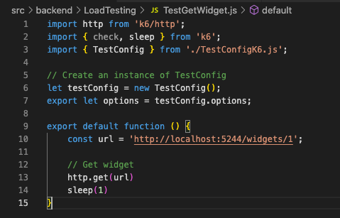

# Relatório dos testes de carga

## K6
Os testes de carga k6 são uma metodologia de testes de performance que simula usuários acessando um aplicativo ou serviço web para determinar como o sistema se comporta sob estresse. Utilizando a ferramenta k6, que é moderna e de código aberto, os desenvolvedores podem identificar gargalos, medir a capacidade máxima de carga, avaliar tempos de resposta e assegurar que o sistema pode manter a qualidade do serviço sob diferentes níveis de demanda.

## Cenários de Teste de Performance

Os cenários de teste são definidos para simular uma quantidade específica de usuários virtuais (VUs) acessando o sistema simultaneamente. Cada cenário possui uma duração específica durante a qual os usuários virtuais são simulados.

### Cenários Detalhados

- **Cenário 1**
  - `duration`: 1m
  - `target`: 10
  - **Descrição**: Este cenário especifica uma duração total de teste de 1 minuto, com o objetivo de simular 10 usuários virtuais ativos simultaneamente.

- **Cenário 2**
  - `duration`: 1m
  - `target`: 50
  - **Descrição**: Semelhante ao cenário anterior, mas aumenta o número de usuários virtuais para 50. O teste é executado por 1 minuto.

- **Cenário 3**
  - `duration`: 1m
  - `target`: 100
  - **Descrição**: Este cenário aumenta o número de usuários virtuais para 100, mantendo a duração do teste em 1 minuto.

### Teste para Endpoint

- **Endpoint**: `getAllWidgets`
  - Descrição: Este endpoint deve ser testado nos cenários acima para avaliar a performance sob diferentes cargas de usuários virtuais.

### Teste para endpoint getAllWidgets:

</img>

### Teste para endpoint TestGetWidgetById: 

</img>

### Teste para endpoint TestPostNps: 

</img>

### Teste para endpoint TestPostWidget:

</img>
</img>

## Cenários 4, 5 e 6:
  - `Teste Delete Widgets By Id`
  - `Teste Put Widgets Id`
  - `Teste Get Widgets Id Embadded`

### Teste Delete Widget By Id:
</img>
*Resultados do teste de carga para o endpoint `DeleteWidgetById`, com insights de como a API lida com solicitações de deleção sob carga.*

### Teste Put Widget Id:

</img>
</img>
*Resultados do teste de carga para o endpoint `PutWidgetId`, demonstrando a resiliência e estabilidade do endpoint ao atualizar dados do widget concorrentemente.*

### Teste Get Widget Id Embedded:

</img>
</img>
*O teste demonstra como as solicitações de widget embutido se comportam sob uma carga significativa de usuários.*

## Conclusão:

A realização dos testes de carga com a ferramenta k6 ofereceu insights valiosos sobre a robustez e a escalabilidade da nossa aplicação. As métricas coletadas apontam para uma performance consistente e confiável em diversos endpoints, demonstrando a capacidade do sistema em lidar com um volume alto de requisições simultâneas. Esses testes foram fundamentais para garantir que a experiência do usuário permaneça estável e eficiente mesmo em picos de uso, assegurando que a infraestrutura atual atenda às demandas do negócio e identificando áreas que podem se beneficiar de otimizações futuras.

